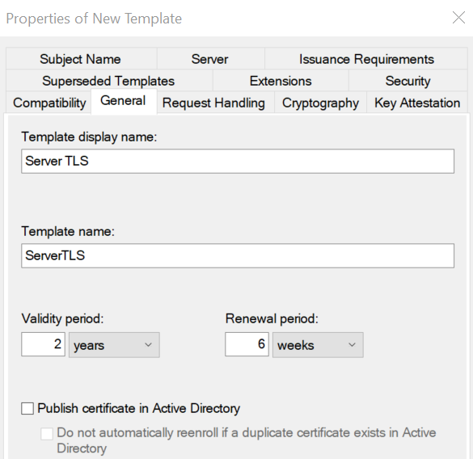
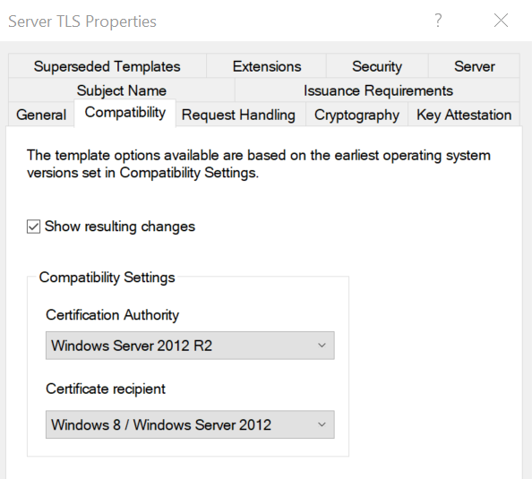
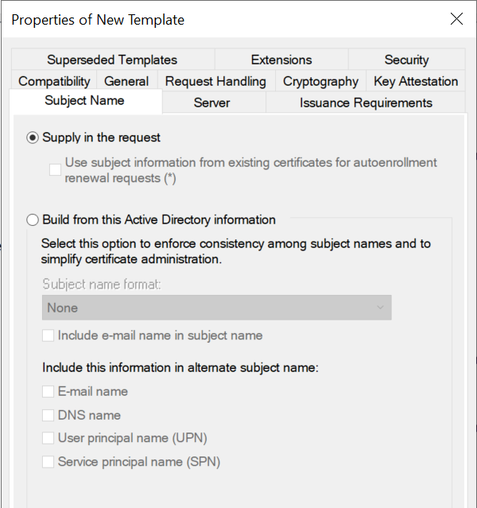
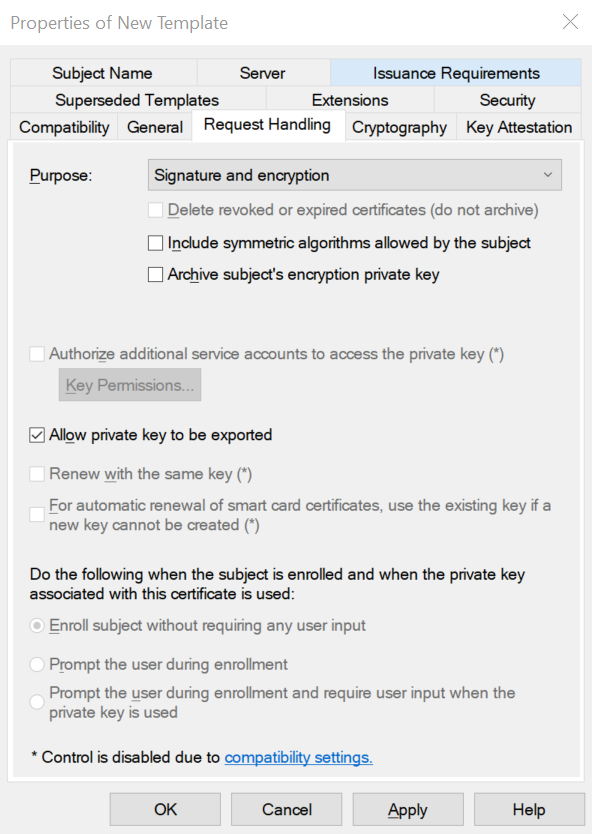

# How to create a certificate template
Authors: Ofir and Irakli\
How to create a certificate template

## Creating a new template:
1. Launch PowerShell and run: `certtmpl.msc`
2. Right-click **Web server** -> **Duplicate Template**

## settings:
1. **General**:
    - Set Template display name to **Server TLS**
    
2. **Compatibility**:
    - Set **Certification authority** to **Windows Server 2012 R2**
    - Set **Certificate recipient** to **Windows 8 / Windows Server 2012**
    
3. **Subject Name**:
    - Select Supply in request

    

4. **Extensions**:
        - Enable **Digital Signature**
        - Enable **Key Encipherment**
        - Disable **Certificate signing**
        - Disable **CRL Signing**
        - Press **Make this extension critical**
    2. Click **Application policies** -> **Edit**
        - Keep only **Server Authentication**
5. **Request handling**:
    - Enable **Allow private key to be exported**

    

6. **Security**:
    
7. Click **Ok**

## Publishing the template (GUI):
 1. Launch PowerShell and run: `certsrv.msc`
 2. **CA** -> Right-click **Certificate Templates** -> **New** -> **Certificate Template to Issue** -> Select **Server TLS** -> Click **Ok** 

## Publishing the template (PowerShell Administrator):
```PowerShell
certutil -setcatemplates +ServerTLS
```


