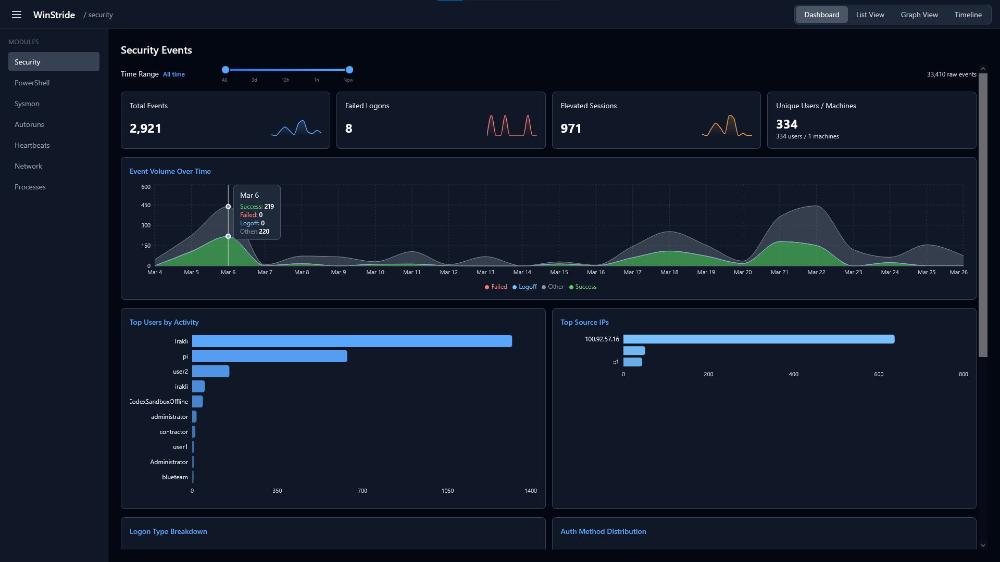
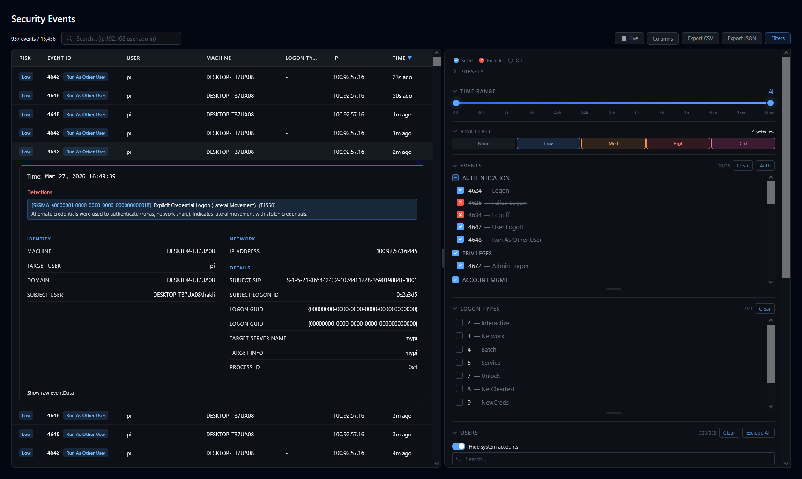
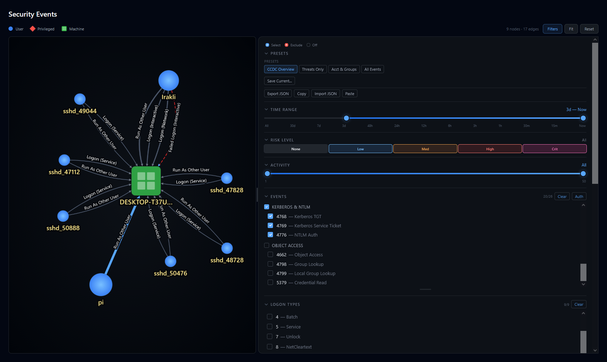
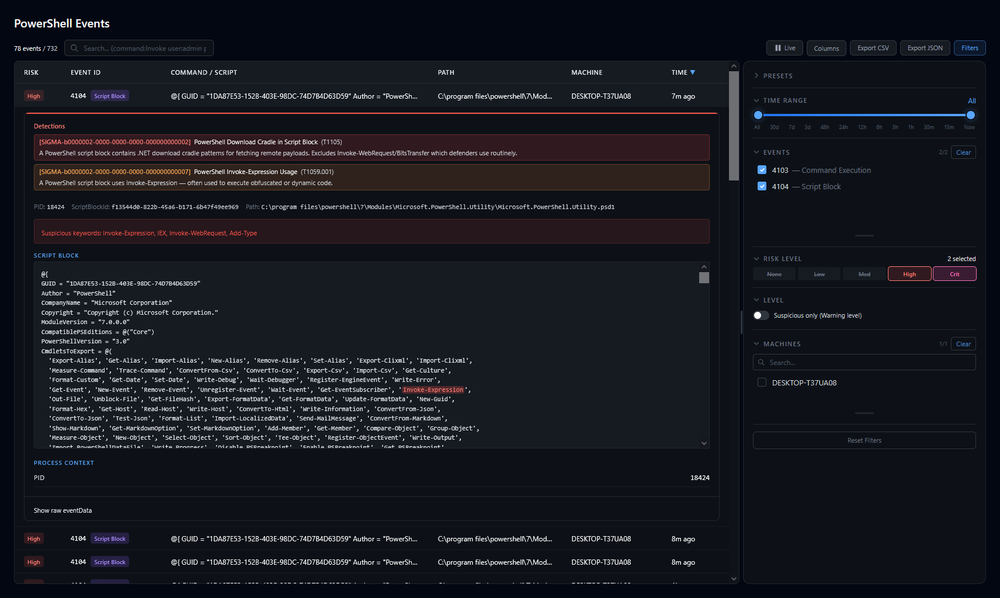
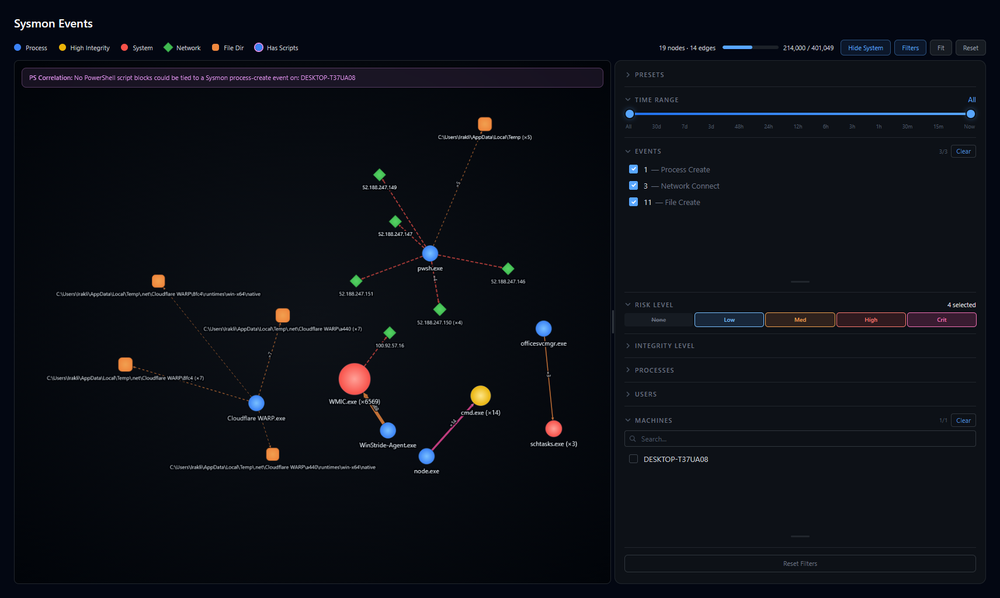
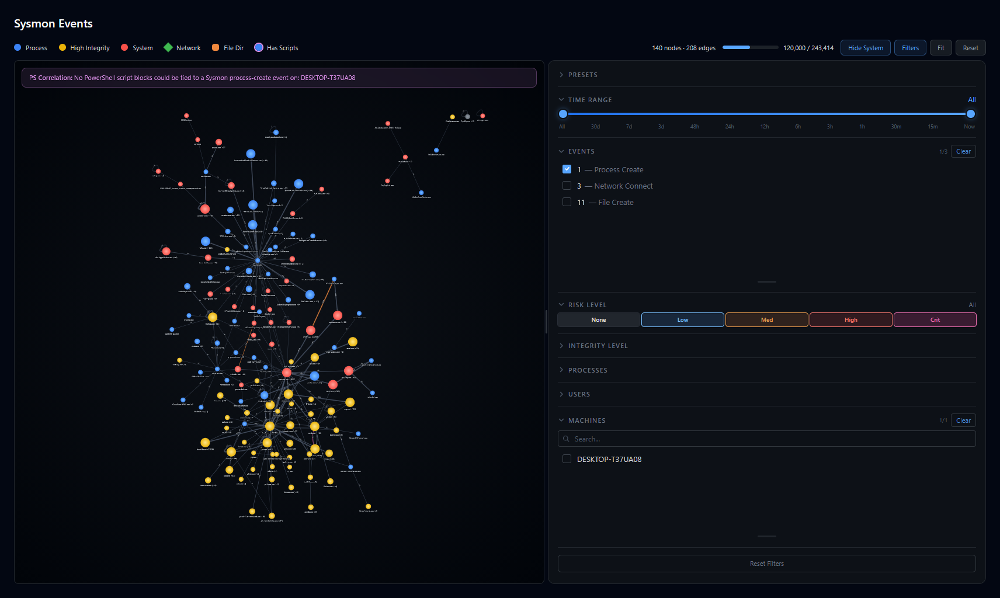
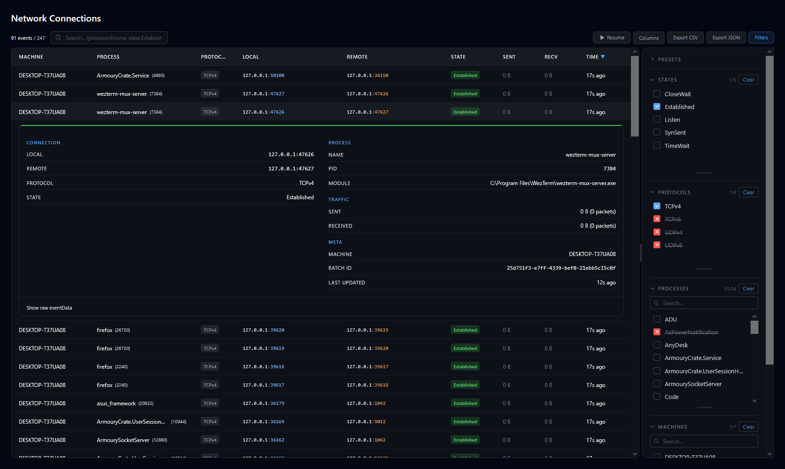
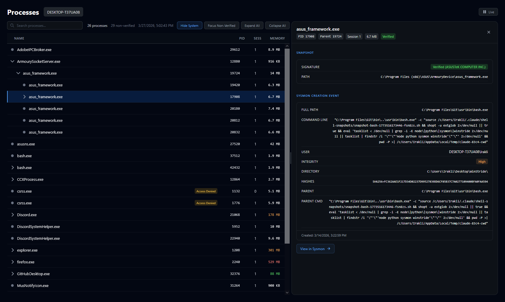
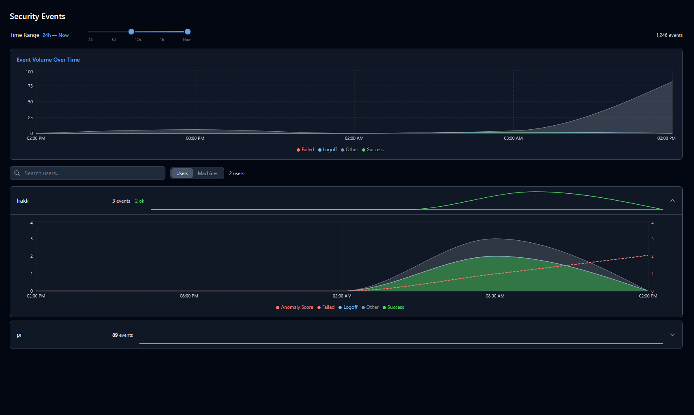
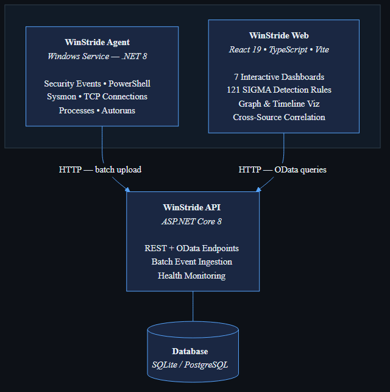

<p align="center">
  
</p>

<h1 align="center">WinStride</h1>

<p align="center">
  <strong>Open-source Windows security monitoring and threat detection platform</strong>
  <br />
  Collect endpoint telemetry. Correlate across sources. Detect threats with SIGMA rules.
</p>

<p align="center">
  <a href="LICENSE"></a>
  
  
  
  
  
</p>

<p align="center">
  <a href="#quick-start">Quick Start</a> &middot;
  <a href="#features">Features</a> &middot;
  <a href="#architecture">Architecture</a> &middot;
  <a href="#configuration">Configuration</a> &middot;
  <a href="#api-reference">API Reference</a>
</p>

---

## Why WinStride?

Most open-source SIEM tools are built for Linux-first environments, require complex multi-service deployments (Elasticsearch, Logstash, Kibana, Beats...), and take hours to configure before you see a single event.

WinStride is different:

- **Single-binary agent, single-binary API, zero-config database.** Clone, run one script, see events in your browser.
- **SIGMA rules run client-side in the browser** — 121 detection rules compiled from YAML and evaluated in real-time with no backend processing lag.
- **Built for Windows from day one** — native Windows service agent, Windows event log integration, Sysmon correlation, PowerShell script block capture.
- **Cross-source correlation** — PowerShell executions are automatically linked with Sysmon process context. Security events are enriched with network and process data.
- **Interactive graph visualizations** — not just tables and charts. Explore user-to-machine authentication relationships, process trees, and event timelines visually.

---

## Features

### Security Dashboard

Real-time security metrics with event volume timelines, top user/IP breakdowns, logon type distribution, authentication method analysis, and a failed logon tracker — all with adjustable time ranges.

<p align="center">
  
</p>

<details>
<summary><strong>Telemetry collected</strong></summary>

| Source | Events |
|--------|--------|
| **Security Events** | Logon success/failure (4624/4625), privilege escalation (4672), account management (4720-4767), audit log clearing (1102) |
| **PowerShell** | Script block logging (4104), module logging (4103) — full command content captured |
| **Sysmon** | Process creation (1), network connections (3), file creation (11) |
| **Network** | Real-time TCP connection tracking across all monitored machines |
| **Processes** | Running process inventory with signature verification status |
| **Autoruns** | Startup program monitoring via Sysinternals `autorunsc.exe` |
| **Heartbeats** | Machine availability and health tracking |

</details>

### SIGMA Threat Detection

121 compiled SIGMA rules and 9 correlation rules evaluate events directly in the browser. Detections are color-coded by severity and integrated into every view — event lists, graphs, and process trees.

**Detection categories include:** Kerberoasting, DC Sync, ASREP roasting, AMSI bypass, PowerShell credential theft, encoded command execution, brute force detection, password spray, privilege escalation after account creation, and more.

### Logon Graph

Interactive network visualization of user-to-machine authentication relationships. Nodes represent users and machines; edges represent logon events with thickness proportional to activity frequency. Filter by time range, risk level, event type, logon type, and specific users or machines.

<p align="center">
  
</p>

### PowerShell Monitoring

Full script block capture with syntax-highlighted command content. Each event is checked against SIGMA rules for indicators like AMSI bypass, download cradles, encoded commands, and offensive cmdlets. Correlated with Sysmon process context when available.

<p align="center">
  
</p>

### Sysmon Process Trees

Hierarchical process tree visualization built on Cytoscape.js. Nodes are color-coded by type — process creation (blue), high integrity (yellow), system (red), network activity (green), file activity (orange). PowerShell processes are highlighted. Detection severity badges are integrated directly into the tree.

<p align="center">
  
</p>

<details>
<summary><strong>Zoomed out — 140 nodes, 208 edges</strong></summary>
<p align="center">
  
</p>
</details>

### Network Connections

Real-time TCP connection monitoring across all agents. Expandable detail rows show process information, packet counts, and connection metadata. Filter by process, protocol, address, port, and state.

<p align="center">
  
</p>

### Process Inventory

Live process tree with memory usage color-coding (red >500MB, orange >100MB, green >50MB), signature verification status badges, and expandable detail panels showing command lines, file paths, integrity levels, and parent process chains. Click through to Sysmon for deeper investigation.

<p align="center">
  
</p>

### Autoruns

Monitors programs configured to run at Windows startup via Sysinternals `autorunsc.exe`. Tracks entry location, publisher, image path, and signature verification status to surface unsigned or suspicious startup entries.

### Heartbeats

Machine availability monitoring. Agents send periodic heartbeats; the dashboard shows which machines are online, stale, or offline with last-seen timestamps. Useful for tracking fleet health across monitored endpoints.

### Timeline Analysis

Per-entity event timelines with anomaly detection. Search for any user, machine, or IP to see their activity over time alongside the global event volume. Useful for investigating individual accounts or correlating activity across time windows.

<p align="center">
  
</p>

---

## Architecture

<p align="center">
  
</p>

The **Agent** runs as a native Windows service, collecting telemetry from event logs, the network stack, and the process table, then sends batches to the **API**. The **API** stores events in SQLite (or PostgreSQL) and exposes OData-queryable endpoints. The **Web** frontend fetches data, runs 121 SIGMA rules client-side, correlates events across sources, and renders interactive dashboards.

---

## Quick Start

### Prerequisites

| Requirement | Version |
|-------------|---------|
| Windows | 10 or later |
| .NET SDK | 8.0+ |
| Node.js | 20.19+ or 22.12+ |
| PowerShell | 7+ (recommended) |

### 1. Clone and set up

```powershell
git clone https://github.com/Ofish-Ofish/WinStride.git
cd WinStride
.\scripts\setup-winstride.ps1
```

The setup script validates prerequisites and offers to install missing dependencies.

### 2. Start all services

```powershell
# Production mode — installs as Windows services
.\scripts\start-winstride.ps1

# Development mode — runs in separate terminal windows
.\scripts\start-winstride.ps1 -DevMode
```

### 3. Open the dashboard

Navigate to **http://localhost:5173** in your browser.

The agent begins collecting events immediately. Give it a minute, then check the Security dashboard to see data flowing in.

---

## Installation

### Certificate Authentication (Optional)

For mutual TLS between agent and API:

```powershell
.\scripts\setup-certs.ps1
```

Skip this if running locally or on a trusted network.

### Agent on Remote Machines

To monitor additional machines, copy the published agent to the target and install:

```powershell
.\scripts\install-run-agent.ps1
```

Update `config.yaml` on the target machine to point `baseUrl` to your API server's address.

### Importing Existing Event Logs

Ingest `.evtx` files from other machines or forensic images:

```powershell
.\scripts\ingest-evtx.ps1 -Path "C:\path\to\exported.evtx"
```

### Selective Service Start

```powershell
.\scripts\start-winstride.ps1 -NoAgent   # API + Web only
.\scripts\start-winstride.ps1 -NoWeb     # API + Agent only
```

---

## Configuration

### Agent — `WinStride-Agent/WinStride-Agent/config.yaml`

```yaml
global:
  baseUrl: "http://localhost:5090/api/Event"
  batchSize: 500
  heartbeatInterval: 60

logs:
  Security:
    enabled: true
    includeIds:
      - 1102    # Audit log cleared
      - 4624    # Successful logon
      - 4625    # Failed logon
      - 4648    # Explicit credential logon
      - 4672    # Special privileges assigned
      - 4720    # Account created
      # ... full list in config.yaml

  Microsoft-Windows-PowerShell/Operational:
    enabled: true
    includeIds:
      - 4103    # Module logging
      - 4104    # Script block logging

  Microsoft-Windows-Sysmon/Operational:
    enabled: true
    includeIds:
      - 1       # Process creation
      - 3       # Network connection
      - 11      # File creation
```

### API — `WinStride-Api/WinStride-Api/appsettings.json`

| Setting | Default | Description |
|---------|---------|-------------|
| `HttpPort` | `5090` | HTTP listen port |
| `HttpsPort` | `7097` | HTTPS listen port |
| `CorsOrigins` | `["http://localhost:5173"]` | Allowed frontend origins |
| `DefaultConnection` | `Data Source=winstride.db` | Database connection string |
| `ServerCertThumbprint` | `""` | Set to enable mTLS |

### Using PostgreSQL

```powershell
cd deploy
docker-compose up -d
```

Then update the connection string in `appsettings.json`.

---

## API Reference

The API supports REST and OData query protocols. Swagger UI is available at `http://localhost:5090/swagger` in development mode.

| Method | Endpoint | Description |
|--------|----------|-------------|
| `GET` | `/api/Event` | Query security events (OData) |
| `POST` | `/api/Event/batch` | Bulk upload events |
| `GET` | `/api/Event/health` | Health check |
| `GET` | `/api/Heartbeat` | Machine heartbeat data |
| `GET` | `/odata/NetworkConnections` | Network connections |
| `GET` | `/odata/WinAutoruns` | Autorun programs |
| `GET` | `/odata/WinProcesses` | Process inventory |

### OData Query Examples

```
# Failed logons in the last hour
GET /api/Event?$filter=EventId eq 4625 and TimeCreated gt 2026-03-27T00:00:00Z

# Events from a specific machine
GET /api/Event?$filter=MachineName eq 'WORKSTATION-01'

# Top 10 most recent events
GET /api/Event?$orderby=TimeCreated desc&$top=10

# External network connections
GET /odata/NetworkConnections?$filter=RemoteAddress ne '127.0.0.1'
```

---

## Project Structure

```
WinStride/
├── WinStride-Agent/              # Windows agent (.NET 8 / C#)
│   └── WinStride-Agent/
│       ├── agent.cs              # Service entry point
│       ├── LogMonitor.cs         # Event log collection
│       ├── NetworkService.cs     # TCP connection monitoring
│       ├── WinProcesses.cs       # Process inventory
│       ├── AutorunService.cs     # Startup detection
│       └── config.yaml           # Agent configuration
│
├── WinStride-Api/                # REST + OData API (.NET 8 / C#)
│   └── WinStride-Api/
│       ├── Program.cs            # Startup and middleware
│       ├── Controllers/          # API endpoints
│       ├── Models/               # Data transfer objects
│       └── Data/                 # EF Core database context
│
├── Winstride-Web/                # Dashboard (React 19 + TypeScript + Vite)
│   └── src/
│       ├── modules/              # Feature dashboards
│       │   ├── security/         # Dashboard, graph, list, timeline
│       │   ├── powershell/       # Script block monitoring
│       │   ├── sysmon/           # Process tree visualization
│       │   ├── network/          # Connection monitoring
│       │   ├── processes/        # Process inventory
│       │   ├── autoruns/         # Startup programs
│       │   └── heartbeats/       # Machine health
│       └── shared/
│           ├── detection/        # SIGMA rule compiler + engine
│           ├── correlation/      # Cross-source event linking
│           └── graph/            # Cytoscape.js integration
│
├── rules/                        # SIGMA detection rules (YAML)
│   ├── security/                 # Account, privilege, Kerberos rules
│   ├── powershell/               # Script block detection rules
│   ├── sysmon/                   # Process, network, file rules
│   └── correlations/             # Multi-event correlation rules
│
├── scripts/                      # PowerShell setup and management
│
└── deploy/                       # Docker Compose + published binaries
```

---

## Tech Stack

| Component | Technology |
|-----------|------------|
| Agent | C# / .NET 8 / Windows Service |
| API | ASP.NET Core 8 / OData / Entity Framework Core |
| Database | SQLite (default) or PostgreSQL |
| Frontend | React 19 / TypeScript 5.9 / Vite 7 |
| Styling | Tailwind CSS 4 |
| Graphs | Cytoscape.js with fCoSE layout |
| Charts | Recharts |
| Data Fetching | TanStack React Query |
| Detection | SIGMA rules compiled from YAML to JavaScript |

---

## License

This project is licensed under the **GNU General Public License v3.0** — see the [LICENSE](LICENSE) file for details.

Copyright (C) 2026 Ofir van Creveld & Irakli Dzaganishvili
