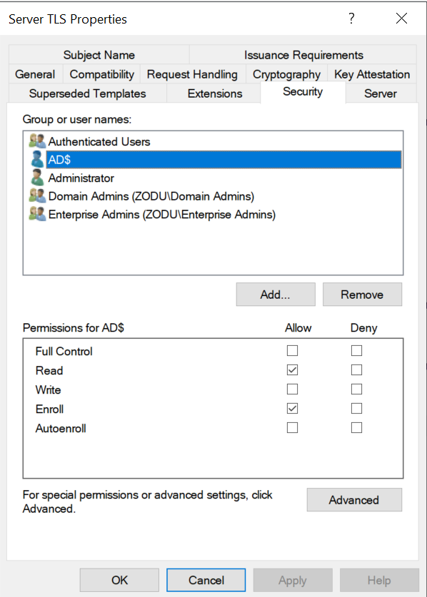

# Certificate Authority

- [Quick Setup](#quick-setup)
- [Detailed GUI Setup](#detailed-gui-setup)
- [Creating a Certificate Template](#creating-a-certificate-template)
- [Requesting, Issuing, and Exporting Certificates](#requesting-issuing-and-exporting-certificates)
- [Viewing Certificates](#viewing-certificates)

---

## Quick Setup

1. Join the machine to your domain
2. Download the CA from Server Manager (AD CS)
3. Select all options when installing the CA. The web portal & extra features are useful.
4. On the domain controller, add a user to the `Cert Publishers` group in AD Users and Computers
5. Log into the CA with this user, so they have the necessary permissions.

---

## Detailed GUI Setup

> [!IMPORTANT]
> Make sure to log on as Domain\Administrator

See [Active Directory - CA Installation](active-directory.md#ca-installation-gui) for the full Server Manager walkthrough.

**Automated installer script:** `scripts/CA_Enterprise_Installer.ps1`

---

## Creating a Certificate Template

Authors: Ofir and Irakli

### Creating a new template
1. Launch PowerShell and run: `certtmpl.msc`
2. Right-click **Web server** -> **Duplicate Template**

### Settings

**1. General:**
- Set Template display name to **Server TLS**


**2. Compatibility:**
- Set **Certification authority** to **Windows Server 2012 R2**
- Set **Certificate recipient** to **Windows 8 / Windows Server 2012**


**3. Subject Name:**
- Select Supply in request


**4. Extensions:**
1. Click **Key Usage** -> **Edit**
    - Enable **Digital Signature**
    - Enable **Key Encipherment**
    - Disable **Certificate signing**
    - Disable **CRL Signing**
    - Press **Make this extension critical**
2. Click **Application policies** -> **Edit**
    - Keep only **Server Authentication**

**5. Request handling:**
- Enable **Allow private key to be exported**


**6. Security:**
- Grant **Read** & **Enroll** permissions to Domain Computers



**7.** Click **Ok**

### Publishing the template (GUI)
1. Launch PowerShell and run: `certsrv.msc`
2. **CA** -> Right-click **Certificate Templates** -> **New** -> **Certificate Template to Issue** -> Select **Server TLS** -> Click **Ok**

### Publishing the template (PowerShell)
```powershell
certutil -setcatemplates +ServerTLS
```

---

## Requesting, Issuing, and Exporting Certificates

Authors: Ofir and Irakli

### Create a .inf file
> [!IMPORTANT]
> Do the following on a domain-joined Windows machine

Create a file `{NAME}.inf` and write:
```ini
[Version]
Signature="$Windows NT$"

[NewRequest]
Subject = "CN={DNS ENTRY FOR THE MACHINE REQUESTING THE CERTIFICATE}"
KeySpec = 1
KeyLength = 2048
Exportable = TRUE
MachineKeySet = TRUE
ProviderName = "Microsoft Software Key Storage Provider"
RequestType = PKCS10
HashAlgorithm = SHA256

[Extensions]
2.5.29.17 = "{text}"
_continue_ = "dns={DNS ENTRY FOR THE MACHINE REQUESTING THE CERTIFICATE}&"

[RequestAttributes]
CertificateTemplate = ServerTLS
```

### Generate request
```powershell
certreq -new {NAME}.inf {NAME}.req
```

### Submit request
```powershell
certreq -submit {NAME}.inf {NAME}.req
```
Select your Enterprise CA.

### Issue certificate
```powershell
certreq -accept {NAME}.req
```

### Exporting the certificate (GUI)
1. Open **mmc** -> Click **File** -> **Add/Remove snap-in...** -> Double click **Certificates** -> **Computer account** -> **Local computer** -> **Finish** -> **Ok**
2. **Certificates (Local Computer)** -> **Personal** -> **Certificates** -> Right Click **{DNS ENTRY}** -> **All tasks** -> **Export**
3. Select **Yes, export the private key** -> **PKCS # 12 (.PFX)** -> Select **Include all certificates in the certification path if possible** & **Enable certificate privacy** -> Set a password -> Select Encryption **AES256-SHA256** -> File name **{NAME}.pfx** -> **Finish**
4. Copy the file and transfer it to the appropriate machine.

### Exporting the certificate (PowerShell)
```powershell
$cert = Get-ChildItem Cert:\LocalMachine\My |
    Where-Object { $_.Subject -like "*CN={DNS ENTRY}*" }

$pwd = ConvertTo-SecureString "PFX_PASSWORD_HERE" -AsPlainText -Force

Export-PfxCertificate `
    -Cert $cert `
    -FilePath "C:\Path\To\{NAME}.pfx" `
    -Password $pwd `
    -ChainOption BuildChain `
    -CryptoAlgorithmOption AES256_SHA256
```

### Extracting private key
```
openssl pkcs12 -in {name}.pfx -nocerts -nodes -out {name}.key
```

### Extracting certificate
```
openssl pkcs12 -in {name}.pfx -nocerts -nokeys -out {name}.crt
```

---

## Viewing Certificates

### Via MMC
1. Go to mmc, add `Certificates` snap-in
2. Select the account/computer you want to view the certificates for.

### Via Event Viewer
Check certificate-related events in the Event Viewer.
