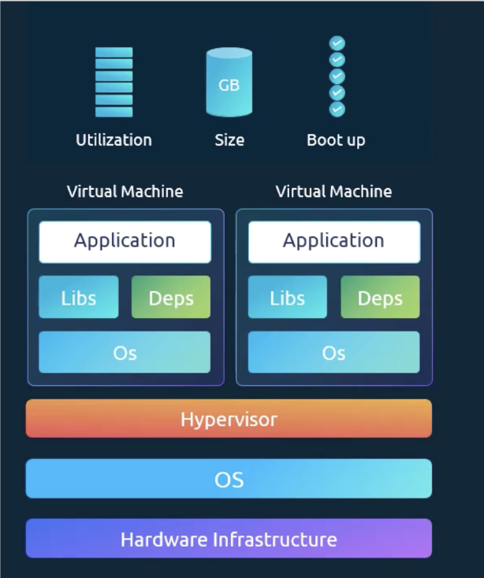
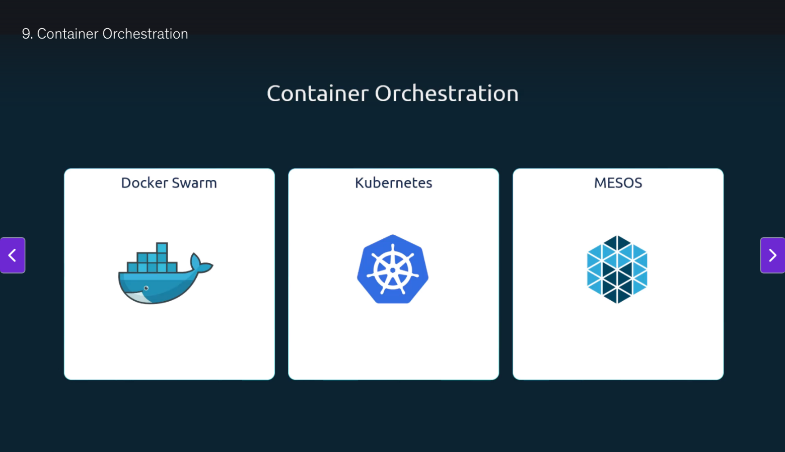
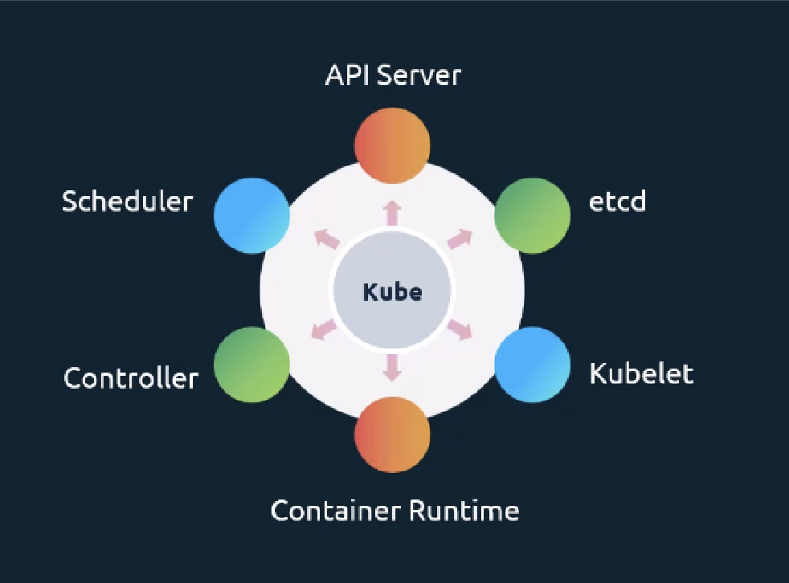
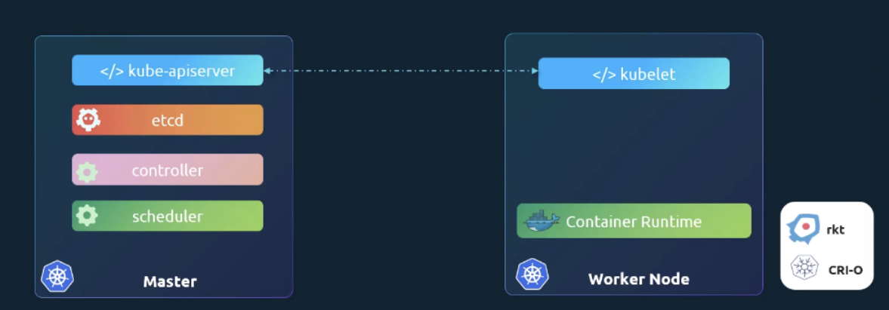
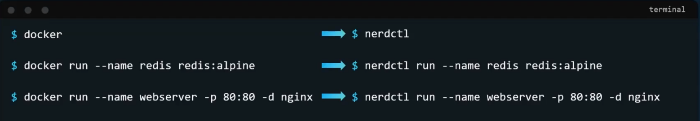
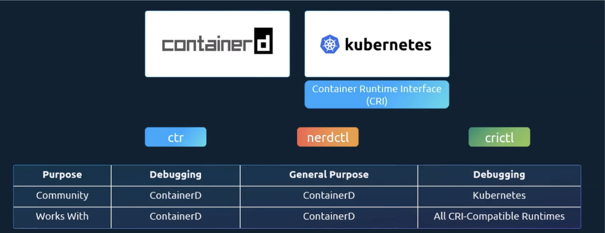

# Kubernetes Introduction

## Docker vs Kubernetes

- In the beginning there was just Docker
- There were others but Docker was the GOAT
- Then came Kubernetes which came to orchestrate Docker
- Back then Kubernetes only orchestrated Docker

## Need for Containers

- If you say, have a project that's using multiple services, it's hard to see if all the services work with the OS and if all the dependencies and libraries work with the OS. You also have to make sure all the various components are compatible with each other. This mess is referred to as the **matrix from hell**.

- With Docker, you are able to run all the components in separate containers with their own dependencies and their own libraries and all in the same OS. You just had to build the docker configuration once and no one needed to worry about the previous issues.

- Containers are completely isolated environments but they all share the same OS kernel.

- Setting up containers are hard and low level so Docker kind of makes it "high level" and much easier to set up.

- The image below is if you used virtual machines instead of containers. You would have multiple operating systems so more utilization, more size used up and the boot up is MUCH longer.

****

---

## The Three Main Options

****

- Docker Swarm is the easiest to use but lacks many features
- MESOS is the hardest to use but is best for many complicated features
- Kubernetes is like in the middle

The shortest way of explaining Kubernetes is that it's a container orchestration technology that manages and deploys THOUSANDS of containers within a cluster.

---

## The Architecture of Kubernetes

### The Parts:

- **Node**: A machine (physical or virtual) where kubernetes is installed. It's a worker machine where containers will be launched by kubernetes.

- If a node fails, you need multiple nodes to help make up for them

- **Cluster**: A group of nodes "clustered" together. It's meant to solve the problem of a node failing

- **Master**: Responsible for managing a cluster, it stores all the information about the members of the cluster, it monitors the node and is responsible for the actual orchestration.

### Components installed on a kubernetes system:

- The API Server
- The Scheduler
- Etcd
- Controller
- Kubelet
- Container runtime

****

**API Server**: Acts as the frontend of the Kubernetes Cluster

**Etcd**: Key-value store to store all data used to manage the cluster

**Scheduler**: Responsible for distributing work or containers across multiple nodes.

**Controller**: The brains behind orchestration, responsible for noticing and responding when nodes, containers or endpoints go KABOOM

**Container Runtime**: The underlying software used to run the containers, i.e. docker

**Kubelet**: The agent that runs on each node in the cluster. An agent is responsible for interacting with the master and for making sure that the containers are running on the node as expected.

---

## Master vs Worker Nodes

- Worker Nodes are where the containers are hosted
- Master is where the API server is
- Worker nodes have the Kubelet agent that's responsible for interacting with the master

****

---

## Kubectl - Kube Command Line Tool / Kube Control

- A very important Cmd Line tool
- Used to deploy and manage applications on a Kubernetes cluster to get cluster information, get status of other nodes, and to manage other things

### Commands:

- `kubectl run` : used to deploy an application
- `kubectl cluster-info` : used to view info about the cluster and the cube
- `kubectl get nodes` : used to list all the nodes apart of the cluster

---

## Docker vs Containerd
### ContainerD:

- Apart of Docker but its own project itself
- You can install containerd without Docker now if you don't want all that extra stuff from docker
- Normally you just use the docker commands but if docker isn't installed then you use the command line tool called **ctr**
- Its sole purpose is to debug containerD and it's not very user friendly
- It has a limited set of features
- Any other way you want to interact with containerD you'd need to make API calls

### Example CTR Commands:

- Downloads the image from Docker Hub into containerD's local image store:
```bash
  ctr images pull docker.io/library/redis:alpine
```

- Runs a new container named "redis" using the image pulled:
```bash
  ctr run docker.io/library/redis:alpine redis
```

- But this CTR tool should NOT be used for a production environment, it's just unnecessarily complicated.

### Better Alternative to CTR: nerdctl

- Docker-like CLI for containerd
- Supports *almost* all of the options Docker supports
- Gives us access to the newest features implemented into containerd such as:
  - Encrypted container images
  - Lazy pulling
  - P2P image distribution
  - Image signing and verifying
  - Namespaces in Kubernetes

### Docker vs nerdctl commands:

****

---

## Universal Command Line Utility: CRI

- Also known as CTL, CRI Control, crictl
- Works across different container runtimes, not just for containerd
- Not used to create containers, it's meant for debugging purposes
- (Can technically make containers but it's hard and unnecessary)
- Works along with the Kubelet

### Example CRI Commands:

- Downloads the image from the default container registry:
```bash
  crictl pull busybox
```

- Lists all container images currently available on the system:
```bash
  crictl images
```

- Lists ALL containers, including running and stopped ones:
```bash
  crictl ps -a
```

- Lists all RUNNING containers:
```bash
  crictl ps
```

- Runs the command "ls" inside the container with the ID:
```bash
  crictl exec -i -t 3e025d50a72d956c4f14881fbb5b1080c9275674e95fb67f965f6478a957d60 ls
```

- Displays the logs of the container with that ID:
```bash
  crictl logs 3e025d50a72d956c4f1
```

- Lists all pods managed by the CRI (shows pod ID, name, namespace, & state):
```bash
  crictl pods
```

****