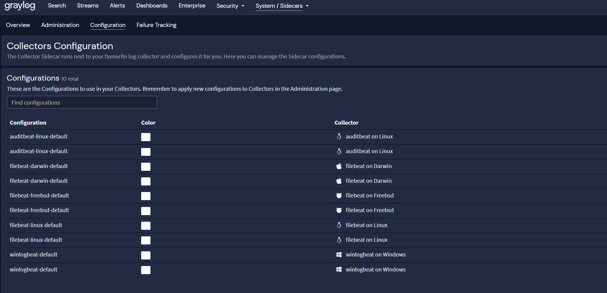
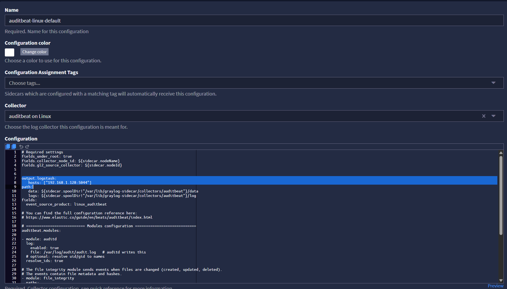

# Graylog Dashboard Installation

WHAT THIS IS:  
Very brief guide on how to install/setup the essential Linux logging dashboard - rsyslogs and audtid logs. This is still WIP (Work in progress), as testing the dashboard install with Graylog slightly preconfigured (streams, inputs, pipelines) needs to be tested.  


## 1. Clean the Graylog Web Interface

This has been only tested on a clean system with a fresh install of Graylog, meaning  the following Graylog configuration must be true:  
- Only default streams
- Only default pipelines
- No inputs configured
- Only default indexes

## 2. Install the Logging + Dashboard Content Pack

After everything is brought to a clean "base" state, the content pack `cont2.json` in this directory can be loaded in. If it has not been moved, [this link should take you there.](./cont2.json) 

- Go to the Graylog web Interface  
- Click "System..." on the top right
- Click "Content Packs"
- Click "Upload" on the top right
- Select the `cont2.json` pack (which you can first download locally to your system)
- Then, **make sure to select "install"** on this content pack in the right menu!

## 3. Configure Sidecar Logging Settings

Since the content pack installed an already configured version of the auditbeat collector, it is necessary to remove the old one.  
- Go to the Graylog web Interface
- Click "System..." on the top right
- Click "Sidecars"
- Select "Configuration", you should see something like this below:

 

- Click into both of the "auditbeat-linux-default" collectors, and **delete the one which has a shorter config file!**

You should be left with **one** "auditbeat-linux-default" collector, where you have to modify this line to match your Graylog server IP.  
```
output.logstash:
   hosts: ["192.168.1.128:5044"]
path:
```

Line to modify on the GUI shown below.

 

## 4. Configure your Inputs

All that is left now is to configure the "inputs". This Dashboard/Logging content pack uses:
- A Beats input for Sidecar (auditbeat with auditd log forwarding)
- A rsyslog **TCP** port 5140 input

Both of these inputs can be installed by running their respective scripts from the `/Graylog/0-Scripts/` directory on all of the target agent machines. 